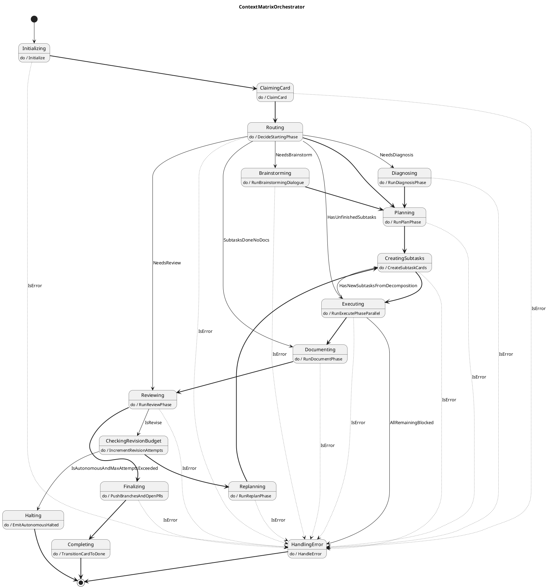

# ContextMatrix Orchestrator FSM

```plantuml
@startuml
title ContextMatrixOrchestrator

[*] --> Initializing

Initializing: do / Initialize
Initializing -[dotted]-> HandlingError: IsError
Initializing -[bold]-> ClaimingCard

ClaimingCard: do / ClaimCard
ClaimingCard -[dotted]-> HandlingError: IsError
ClaimingCard -[bold]-> Routing

Routing: do / DecideStartingPhase
Routing -[dotted]-> HandlingError: IsError
Routing --> Brainstorming: NeedsBrainstorm
Routing --> Diagnosing: NeedsDiagnosis
Routing --> Executing: HasUnfinishedSubtasks
Routing --> Documenting: SubtasksDoneNoDocs
Routing --> Reviewing: NeedsReview
Routing -[bold]-> Planning

Brainstorming: do / RunBrainstormingDialogue
Brainstorming -[dotted]-> HandlingError: IsError
Brainstorming -[bold]-> Planning

Diagnosing: do / RunDiagnosisPhase
Diagnosing -[dotted]-> HandlingError: IsError
Diagnosing -[bold]-> Planning

Planning: do / RunPlanPhase
Planning -[dotted]-> HandlingError: IsError
Planning -[bold]-> CreatingSubtasks

CreatingSubtasks: do / CreateSubtaskCards
CreatingSubtasks -[dotted]-> HandlingError: IsError
CreatingSubtasks -[bold]-> Executing

Executing: do / RunExecutePhaseParallel
Executing -[dotted]-> HandlingError: IsError
Executing --> HandlingError: AllRemainingBlocked
Executing --> CreatingSubtasks: HasNewSubtasksFromDecomposition
Executing -[bold]-> Documenting

Documenting: do / RunDocumentPhase
Documenting -[dotted]-> HandlingError: IsError
Documenting -[bold]-> Reviewing

Reviewing: do / RunReviewPhase
Reviewing -[dotted]-> HandlingError: IsError
Reviewing --> CheckingRevisionBudget: IsRevise
Reviewing -[bold]-> Finalizing

CheckingRevisionBudget: do / IncrementRevisionAttempts
CheckingRevisionBudget --> Halting: IsAutonomousAndMaxAttemptsExceeded
CheckingRevisionBudget -[bold]-> Replanning

Replanning: do / RunReplanPhase
Replanning -[dotted]-> HandlingError: IsError
Replanning -[bold]-> CreatingSubtasks

Finalizing: do / PushBranchesAndOpenPRs
Finalizing -[dotted]-> HandlingError: IsError
Finalizing -[bold]-> Completing

Completing: do / TransitionCardToDone
Completing -[bold]-> [*]

Halting: do / EmitAutonomousHalted
Halting -[bold]-> [*]

HandlingError: do / HandleError
HandlingError -[bold]-> [*]

@enduml
```
